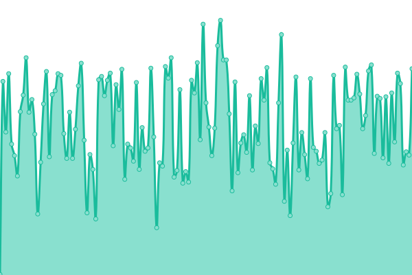

# [📈 Service Live Status](https://haochenpan.github.io/diaspora-uptime-monitor)

This repository contains the open-source uptime monitor and status page for the [Diaspora Project](https://diaspora-project.github.io/), powered by [Upptime](https://github.com/upptime/upptime). We use [Issues](https://github.com/haochenpan/diaspora-uptime-monitor/issues) as incident reports, [Actions](https://github.com/haochenpan/diaspora-uptime-monitor/actions) as uptime monitors, and [Pages](https://haochenpan.github.io/diaspora-uptime-monitor) for the status page.

<!--start: status pages-->
<!-- This summary is generated by Upptime (https://github.com/upptime/upptime) -->
<!-- Do not edit this manually, your changes will be overwritten -->
<!-- prettier-ignore -->
| URL | Status | History | Response Time | Uptime |
| --- | ------ | ------- | ------------- | ------ |
|  [Diaspora Web Service](http://3.220.110.101/) | 🟩 Up | [diaspora-web-service.yml](https://github.com/haochenpan/diaspora-uptime-monitor/commits/HEAD/history/diaspora-web-service.yml) | 

 78ms
     
 | 

<a href="https://haochenpan.github.io/diaspora-uptime-monitor/history/diaspora-web-service">100.00%</a>
    

|  [Diaspora Action Provider](https://diaspora-action-provider.ml22sevubfnks.us-east-1.cs.amazonlightsail.com/) | 🟩 Up | [diaspora-action-provider.yml](https://github.com/haochenpan/diaspora-uptime-monitor/commits/HEAD/history/diaspora-action-provider.yml) | 

 199ms
     
 | 

<a href="https://haochenpan.github.io/diaspora-uptime-monitor/history/diaspora-action-provider">98.34%</a>
    

|  [Diaspora Admin Console](http://100.27.155.7/) | 🟩 Up | [diaspora-admin-console.yml](https://github.com/haochenpan/diaspora-uptime-monitor/commits/HEAD/history/diaspora-admin-console.yml) | 

 108ms
     
 | 

<a href="https://haochenpan.github.io/diaspora-uptime-monitor/history/diaspora-admin-console">100.00%</a>
    

<!--end: status pages-->

[**Visit our status website →**](https://haochenpan.github.io/diaspora-uptime-monitor)

# 🗃️ Diaspora Repositories

| Project                  | Repository URL                                                   | Docs                                              | Demo                                                                               | Live Status |
| ------------------------ | ---------------------------------------------------------------- | ------------------------------------------------- | ---------------------------------------------------------------------------------- | ----------- |
| Diaspora SDK             | [GitHub](github.com/globus-labs/diaspora-event-sdk)              |                                                   | [Notebook](github.com/globus-labs/diaspora-event-sdk/blob/main/DiasporaDemo.ipynb) |             |
| Diaspora Web Service     | [GitHub (Private)](github.com/globus-labs/diaspora-web-service)  |                                                   | See above                                                                          | See above   |
| Diaspora Action Provider | [GitHub](github.com/globus-labs/diaspora-action-provider)        | [Docs](labs.globus.org/diaspora-action-provider/) | [Notebook](github.com/globus-labs/diaspora-action-provider/tree/main/examples)     | See above   |
| Diaspora Uptime Monitor  | [GitHub](github.com/haochenpan/diaspora-uptime-monitor)          |                                                   |                                                                                    |             |
| Diaspora Admin Console   | [GitHub (Private)](github.com/haochenpan/kui-lightsail-compose)  |                                                   |                                                                                    | See above   |
| Benchmarking Diaspora    | [GitHub (Private)](github.com/globus-labs/benchmarking-diaspora) |                                                   |                                                                                    |             |
